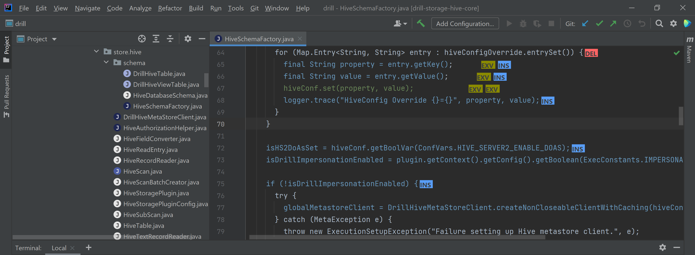

# Code changes plugin

## Description
This plugin for IntelliJ IDEA highlights the code of a Java project based on the changes made on the current commit. It also adds visual elements that, when you hover on them, they show a popup with additional information. Some of those visual elements have click actions. This plugin also overrides the icons of the IntelliJ IDEA file explorer to show with colors on the icons the amount of changes of each file.

You can find a more detailed documentation [here](https://github.com/testFooBar71/highlight-code-plugin/blob/main/files/docs.pdf).

## Themes

On the main branch, this plugin by default works for dark theme. It also works on light theme, but there are some issues with specific colors. The code working for light theme is on the branch [light theme](https://github.com/testFooBar71/highlight-code-plugin/tree/light-theme).

## How to run

From IntelliJ IDEA, click on the Gradle side menu at the right, and on tasks, look for intellij folder and double click on "runIde" task.

## How to build

It is almost same procedure as for running, but instead of the "runIde" task, on the same gradle tasks intellij folder, double click on "buildPlugin". If the build succeeded, it will be located in build/distributions folder starting from the root of the project.

## How to install

In case you don't want to manually build the plugin, you can download the dark theme from [here](https://github.com/testFooBar71/highlight-code-plugin/raw/main/files/installerDarkTheme.zip) and/or the light theme from [here](https://github.com/testFooBar71/highlight-code-plugin/raw/main/files/installerLightTheme.zip).

To install:

1. On IntelliJ IDEA go to File -> Settings
2. Click on "Plugins" on the side menu on the left.
3. Click on the little gear icon at the top right and select "Install Plugin From Disk...".
4. Select the location of the zip of the plugin (whether you builded it manually or downloaded it).
5. Press OK.
6. Restart the IDE.

## Additional information

An experiment has been conducted, testing the plugin with participants and comparing it to using Github to see the code changes. To evaluate the results, two tests have been performed: System Usability Scale (SUS) and NASA-TLX. The results of both tests can be seen [here](https://github.com/testFooBar71/highlight-code-plugin/tree/main/files/experimentResults).